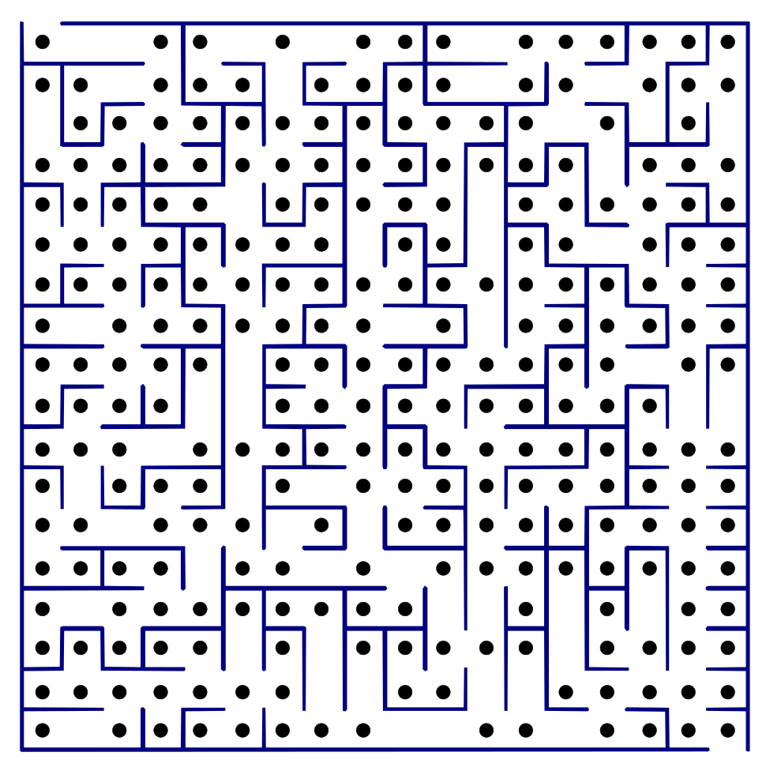

# Proyecto-algoritmia
Este es un proyecto académico en el cual se implementan algoritmos como prim, kruskal y Dijkstra haciendo uso de un grafo creado a partir de imágenes predeterminadas
# otros

    

